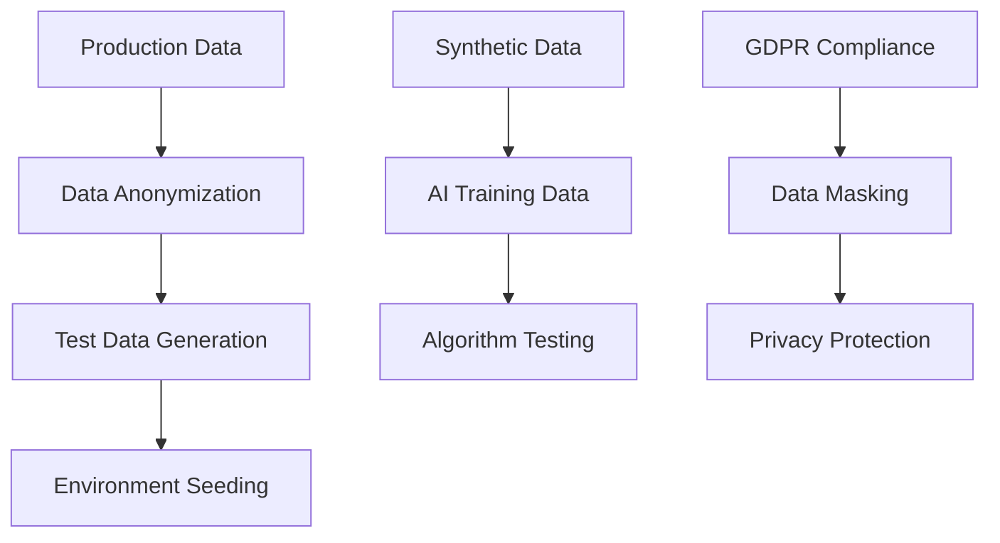
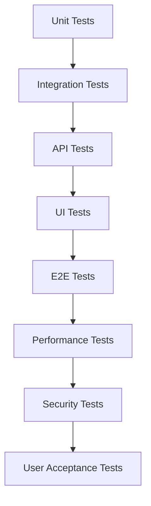

# 🧪 GEP Service Scheduling System - Testing Framework (Production Ready)

## 🎯 Testing Strategy Overview

### 🏗️ Testing Philosophy

**Comprehensive, risk-based testing approach ensuring system reliability, regulatory compliance, and seamless integration with critical business operations while maintaining 99.9% uptime and zero compliance violations.**

### 🔄 Testing Pyramid Structure

```
                🎯 E2E Tests (5%)
              Critical User Journeys
       
           🔗 Integration Tests (25%)  
         API, ERP, SEPE Integrations
       
        🏗️ Component Tests (70%)
      Business Logic, AI Algorithms, UI
```

---

## 📊 Test Categories & Coverage Matrix

### 🔥 Critical Path Testing (Priority 1)

| Test Category                      | Coverage | Risk Level  | Test Depth    | Automation Level |
| ---------------------------------- | -------- | ----------- | ------------- | ---------------- |
| 🏛️**SEPE Compliance**      | 100%     | 🔥 Critical | Exhaustive    | 95% Automated    |
| 🤖**AI Assignment Logic**    | 100%     | 🔥 Critical | Deep          | 90% Automated    |
| 🔄**Softone Integration**    | 100%     | 🔥 Critical | Complete      | 95% Automated    |
| 📅**Schedule Validation**    | 100%     | 🔥 Critical | Comprehensive | 90% Automated    |
| 💰**Financial Calculations** | 100%     | 🔥 Critical | Exhaustive    | 95% Automated    |

### 🎯 Business Critical Testing (Priority 2)

| Test Category                   | Coverage | Risk Level | Test Depth     | Automation Level |
| ------------------------------- | -------- | ---------- | -------------- | ---------------- |
| 👥**User Authentication** | 100%     | 🔴 High    | Complete       | 90% Automated    |
| 📱**Multi-Platform UX**   | 95%      | 🔴 High    | Thorough       | 70% Automated    |
| 🔔**Notification System** | 90%      | 🔴 High    | Standard       | 85% Automated    |
| 📋**Audit Trail**         | 100%     | 🔴 High    | Deep           | 90% Automated    |
| ⚡**Performance & Scale** | 95%      | 🔴 High    | Stress testing | 80% Automated    |

---

## 🏗️ Test Environment Strategy

### 🌐 Environment Architecture

#### 📊 Environment Matrix

| Environment         | Purpose                   | Data                       | Users          | Integration Level    |
| ------------------- | ------------------------- | -------------------------- | -------------- | -------------------- |
| 🧪**DEV**     | Development testing       | Synthetic                  | Developers     | Mock services        |
| 🔄**TEST**    | Feature validation        | Anonymized production data | QA Team        | Staging integrations |
| 🎯**STAGING** | Pre-production validation | Production-like data       | Business users | Full integrations    |
| 🚀**PROD**    | Live system               | Real data                  | All users      | Live integrations    |

#### 🔒 Data Management Strategy



---

## 🤖 AI & Algorithm Testing Framework

### 🎯 AI Assignment Algorithm Testing

#### Performance-Based Matching Tests

| Test Scenario                         | Input Data                             | Expected Outcome                  | Success Criteria                   |
| ------------------------------------- | -------------------------------------- | --------------------------------- | ---------------------------------- |
| 🏆**High Performer Priority**   | Partner with 86.5% completion rate     | Selected for critical assignments | Algorithm favors proven performers |
| ⚠️**Low Performer Handling**  | Partner with 0% completion rate        | Assigned only to low-risk tasks   | Risk mitigation logic working      |
| 🗺️**Geographic Optimization** | Athens-based resources & installations | Minimized travel distance         | 30% travel reduction achieved      |
| ⚖️**Workload Balancing**      | Partners with 2-40 visit variance      | Balanced distribution 15-25 range | Workload variance <100%            |

#### AI Decision Validation Tests

```javascript
// Example Test Structure
describe('AI Partner Assignment Algorithm', () => {
  test('should prioritize high-performing partners for critical installations', () => {
    const installations = mockCriticalInstallations();
    const partners = mockPartnersWithPerformanceData();
  
    const assignments = aiAssignmentEngine.suggest(installations, partners);
  
    expect(assignments.every(assignment => 
      partners.find(p => p.id === assignment.partnerId).completionRate > 70
    )).toBe(true);
  });
  
  test('should respect geographic constraints', () => {
    const athensInstallations = mockAthensInstallations();
    const assignments = aiAssignmentEngine.suggest(athensInstallations, allPartners);
  
    const averageTravelTime = calculateAverageTravelTime(assignments);
    expect(averageTravelTime).toBeLessThan(maxAcceptableTravelTime);
  });
});
```

---

## 🏛️ SEPE Compliance Testing Suite

### 📊 Regulatory Compliance Validation

#### Critical Compliance Tests

| Test Type                                  | Validation                      | Automation     | Frequency        |
| ------------------------------------------ | ------------------------------- | -------------- | ---------------- |
| 📋**Excel Format Validation**        | SEPE-required format compliance | 100% Automated | Every deployment |
| 🔢**Hour Calculation Accuracy**      | SEPE formula compliance         | 100% Automated | Every change     |
| 📅**Schedule Constraint Validation** | Working hours compliance        | 100% Automated | Real-time        |
| 📄**Data Completeness Check**        | All required fields present     | 100% Automated | Pre-export       |

#### SEPE Export Test Scenarios

```python
# SEPE Export Validation Test Suite
class SEPEExportTests:
    def test_export_format_compliance(self):
        """Validate exported Excel matches SEPE requirements exactly"""
        schedule_data = self.generate_test_schedule_data()
        exported_file = sepe_exporter.export(schedule_data)
      
        # Validate Excel structure
        assert_excel_headers_match_sepe_requirements(exported_file)
        assert_data_format_compliance(exported_file)
        assert_no_missing_required_fields(exported_file)
  
    def test_hour_calculation_accuracy(self):
        """Ensure hour calculations match SEPE formulas"""
        installation = mock_installation(employees=46, type='C')
        calculated_hours = sepe_calculator.calculate_hours(installation)
        expected_hours = manual_sepe_calculation(installation)
      
        assert calculated_hours == expected_hours
  
    def test_working_hours_constraint_validation(self):
        """Validate schedules respect installation working hours"""
        installation = mock_installation_with_hours("09:00-17:00")
        schedule = generate_test_schedule(installation)
      
        violations = sepe_validator.validate_working_hours(schedule)
        assert len(violations) == 0
```

---

## 🔄 Integration Testing Framework

### 🏢 Softone ERP Integration Tests

#### API Integration Test Matrix

| Integration Point              | Test Type        | Validation         | Error Handling        |
| ------------------------------ | ---------------- | ------------------ | --------------------- |
| 📊**Project Creation**   | Real-time sync   | Data accuracy      | Retry logic           |
| 👥**Partner Assignment** | Bi-directional   | Status consistency | Rollback capability   |
| 📅**Schedule Updates**   | Event-driven     | Change propagation | Conflict resolution   |
| 💰**Visit Approval**     | Batch processing | Financial accuracy | Transaction integrity |

#### Integration Test Automation

```typescript
// Softone Integration Test Suite
describe('Softone ERP Integration', () => {
  describe('Project Creation Flow', () => {
    it('should sync project data from Softone to Partner Portal', async () => {
      // Arrange
      const softoneProject = createMockSoftoneProject();
    
      // Act
      await softoneIntegration.syncProject(softoneProject);
    
      // Assert
      const partnerPortalProject = await partnerPortal.getProject(softoneProject.id);
      expect(partnerPortalProject).toMatchSoftoneProject(softoneProject);
    });
  
    it('should handle integration failures gracefully', async () => {
      // Simulate network failure
      mockSoftoneAPI.simulateNetworkError();
    
      const result = await softoneIntegration.syncProject(testProject);
    
      expect(result.status).toBe('retry_scheduled');
      expect(result.retryCount).toBeGreaterThan(0);
    });
  });
});
```

---

## 🎨 User Experience Testing Framework

### 📱 Multi-Platform UX Testing

#### User Journey Test Scenarios

| User Type                           | Critical Journey                       | Success Criteria      | Test Method         |
| ----------------------------------- | -------------------------------------- | --------------------- | ------------------- |
| 👨‍💼**Account Coordinator** | Project creation to partner assignment | <5 minutes completion | Automated E2E       |
| 👨‍🔧**Partner**             | Schedule creation with AI suggestions  | 75% AI acceptance     | User simulation     |
| 👨‍💻**Audit Team**          | Visit approval workflow                | <2 minutes per visit  | Performance testing |
| 📱**Mobile User**             | Schedule management on mobile          | Seamless experience   | Device testing      |

#### UX Testing Automation

```javascript
// E2E User Journey Tests
describe('Critical User Journeys', () => {
  test('Account Coordinator: Complete partner assignment flow', async () => {
    await page.login('coordinator@gep.gr');
  
    // Project creation
    await page.click('[data-testid="new-project"]');
    await page.fillProjectDetails(testProjectData);
  
    // AI partner suggestion
    await page.click('[data-testid="get-ai-suggestions"]');
    const suggestions = await page.getAISuggestions();
    expect(suggestions.length).toBeGreaterThan(0);
  
    // Partner assignment
    await page.selectPartner(suggestions[0]);
    await page.click('[data-testid="assign-partner"]');
  
    // Verify assignment
    const assignment = await page.getAssignmentStatus();
    expect(assignment.status).toBe('assigned');
    expect(assignment.duration).toBeLessThan(300000); // 5 minutes
  });
});
```

---

## ⚡ Performance & Load Testing

### 🚀 Performance Testing Matrix

#### Load Testing Scenarios

| Scenario                | Concurrent Users     | Duration   | Success Criteria  |
| ----------------------- | -------------------- | ---------- | ----------------- |
| 🎯**Normal Load** | 50 users             | 1 hour     | <2s response time |
| 📈**Peak Load**   | 200 users            | 30 minutes | <3s response time |
| 🔥**Stress Test** | 500 users            | 15 minutes | System stability  |
| 💥**Spike Test**  | 0→300 users in 1min | 10 minutes | Graceful scaling  |

#### Performance Test Implementation

```javascript
// Performance Test Suite using Artillery.js
module.exports = {
  config: {
    target: 'https://staging.gep-scheduler.com',
    phases: [
      { duration: 300, arrivalRate: 1, name: 'Warm up' },
      { duration: 600, arrivalRate: 10, name: 'Ramp up load' },
      { duration: 1800, arrivalRate: 50, name: 'Sustained load' }
    ]
  },
  scenarios: [
    {
      name: 'Partner Schedule Creation',
      weight: 40,
      flow: [
        { post: '/api/auth/login', json: { email: 'partner@test.com' } },
        { get: '/api/projects/assigned' },
        { post: '/api/schedules', json: { projectId: '{{ projectId }}' } },
        { think: 5 }
      ]
    },
    {
      name: 'AI Partner Suggestions',
      weight: 30,
      flow: [
        { post: '/api/auth/login', json: { email: 'coordinator@test.com' } },
        { post: '/api/ai/partner-suggestions', json: { installationId: '{{ installationId }}' } }
      ]
    }
  ]
};
```

---

## 🔐 Security Testing Framework

### 🛡️ Security Test Coverage

#### Security Testing Matrix

| Security Area               | Test Type              | Coverage | Automation |
| --------------------------- | ---------------------- | -------- | ---------- |
| 🔐**Authentication**  | Penetration testing    | 100%     | 80%        |
| 👥**Authorization**   | Access control testing | 100%     | 90%        |
| 🔒**Data Protection** | GDPR compliance        | 100%     | 70%        |
| 🌐**API Security**    | OWASP Top 10           | 100%     | 85%        |
| 📊**Data Encryption** | At rest & transit      | 100%     | 95%        |

#### Security Test Automation

```python
# Security Testing Suite
class SecurityTests:
    def test_authentication_brute_force_protection(self):
        """Test login rate limiting and account lockout"""
        for attempt in range(10):
            response = self.client.post('/api/auth/login', {
                'email': 'test@gep.gr',
                'password': 'wrong_password'
            })
      
        # Should be rate limited after 5 attempts
        assert response.status_code == 429
  
    def test_role_based_access_control(self):
        """Test unauthorized access prevention"""
        partner_token = self.get_partner_token()
      
        # Partner should not access admin endpoints
        response = self.client.get(
            '/api/admin/users',
            headers={'Authorization': f'Bearer {partner_token}'}
        )
      
        assert response.status_code == 403
  
    def test_sensitive_data_encryption(self):
        """Verify sensitive data is encrypted in database"""
        # Create test user with sensitive data
        user = self.create_test_user()
      
        # Check database directly
        db_record = self.db.execute(
            f"SELECT * FROM users WHERE id = {user.id}"
        ).fetchone()
      
        # Personal data should be encrypted
        assert db_record.email != user.email  # Should be encrypted
        assert self.encryption.decrypt(db_record.email) == user.email
```

---

## 📊 Data Quality Testing

### 🎯 Data Validation Framework

#### Data Quality Test Scenarios

| Data Category              | Validation Type             | Test Coverage | Business Impact |
| -------------------------- | --------------------------- | ------------- | --------------- |
| 📋**Client Data**    | Completeness, accuracy      | 100%          | High            |
| 👥**Partner Data**   | Consistency, integrity      | 100%          | High            |
| 📅**Schedule Data**  | Business rules, constraints | 100%          | Critical        |
| 💰**Financial Data** | Precision, calculations     | 100%          | Critical        |

#### Data Quality Automation

```sql
-- Data Quality Test Queries
-- Test 1: Ensure all active projects have assigned hours
SELECT project_id, client_name 
FROM projects 
WHERE status = 'active' 
  AND (assigned_hours IS NULL OR assigned_hours <= 0);

-- Test 2: Validate partner availability doesn't exceed capacity
SELECT p.partner_id, p.name, 
       SUM(s.scheduled_hours) as total_scheduled,
       p.weekly_capacity
FROM partners p
JOIN schedules s ON p.partner_id = s.partner_id
WHERE s.week_start >= CURRENT_DATE
GROUP BY p.partner_id
HAVING total_scheduled > p.weekly_capacity;

-- Test 3: Check for scheduling conflicts
SELECT s1.partner_id, s1.visit_date, s1.start_time, s1.end_time,
       s2.visit_date, s2.start_time, s2.end_time
FROM schedules s1
JOIN schedules s2 ON s1.partner_id = s2.partner_id
WHERE s1.visit_id != s2.visit_id
  AND s1.visit_date = s2.visit_date
  AND (s1.start_time BETWEEN s2.start_time AND s2.end_time
       OR s1.end_time BETWEEN s2.start_time AND s2.end_time);
```

---

## 🔄 Automated Testing Pipeline

### 🚀 CI/CD Testing Integration

#### Test Execution Pipeline

```yaml
# GitHub Actions Test Pipeline
name: GEP Scheduler Test Suite

on: [push, pull_request]

jobs:
  unit-tests:
    runs-on: ubuntu-latest
    steps:
      - uses: actions/checkout@v3
      - uses: actions/setup-node@v3
      - run: npm install
      - run: npm run test:unit
      - run: npm run test:coverage
  
  integration-tests:
    runs-on: ubuntu-latest
    needs: unit-tests
    services:
      postgres:
        image: postgres:13
      redis:
        image: redis:6
    steps:
      - run: npm run test:integration
      - run: npm run test:api
  
  e2e-tests:
    runs-on: ubuntu-latest
    needs: integration-tests
    steps:
      - run: npm run test:e2e
      - run: npm run test:performance
  
  security-tests:
    runs-on: ubuntu-latest
    steps:
      - run: npm run test:security
      - run: npm audit --audit-level moderate
```

### 📊 Test Reporting & Metrics

#### Test Metrics Dashboard

| Metric                          | Target      | Current | Trend |
| ------------------------------- | ----------- | ------- | ----- |
| 🎯**Test Coverage**       | >95%        | -       | 📈    |
| ⚡**Test Execution Time** | <10 minutes | -       | 📊    |
| 🐛**Bug Detection Rate**  | >90%        | -       | 📈    |
| 🔄**Test Automation**     | >85%        | -       | 📊    |

---

## 📋 Test Data Management

### 🗃️ Test Data Strategy

#### Data Categories & Sources

| Data Type                     | Source               | Volume            | Refresh Frequency |
| ----------------------------- | -------------------- | ----------------- | ----------------- |
| 📊**Production Mirror** | Anonymized prod data | 100%              | Weekly            |
| 🤖**Synthetic Data**    | Data generators      | 10x production    | On-demand         |
| 📋**Edge Cases**        | Manually crafted     | Scenario-specific | As needed         |
| 🔄**Performance Data**  | Load generators      | 1000x normal      | Test execution    |

#### Test Data Generation

```python
# Test Data Factory
class GEPTestDataFactory:
    def generate_client_data(self, count=100):
        """Generate realistic client test data"""
        return [
            {
                'client_code': f'C{str(i).zfill(6)}',
                'company_name': fake.company(),
                'installations': self.generate_installations(random.randint(1, 10)),
                'account_manager': fake.name(),
                'active': random.choice([True, False])
            }
            for i in range(count)
        ]
  
    def generate_partner_performance_data(self, partner_id):
        """Generate realistic performance data for AI training"""
        return {
            'partner_id': partner_id,
            'completion_rate': random.uniform(0.2, 0.9),  # Based on real data range
            'avg_visit_duration': random.uniform(2, 8),   # Based on real data
            'geographic_efficiency': random.uniform(0.6, 0.95),
            'client_satisfaction': random.uniform(3.5, 5.0)
        }
```

---

## 🎯 Test Execution Strategy

### 📅 Testing Schedule & Phases

#### Pre-Production Testing Timeline

| Phase                              | Duration | Focus                | Success Criteria          |
| ---------------------------------- | -------- | -------------------- | ------------------------- |
| 🧪**Alpha Testing**          | 2 weeks  | Core functionality   | All critical tests pass   |
| 🔄**Beta Testing**           | 3 weeks  | User acceptance      | 90% user satisfaction     |
| 🚀**Staging Validation**     | 1 week   | Production readiness | Zero critical issues      |
| 📊**Performance Validation** | 3 days   | Scale & load testing | Meets performance targets |

#### Test Execution Priorities



---

## 📈 Quality Gates & Success Criteria

### ✅ Production Readiness Checklist

#### Critical Quality Gates

| Quality Gate                   | Criteria                       | Status     | Owner           |
| ------------------------------ | ------------------------------ | ---------- | --------------- |
| 🧪**Unit Test Coverage** | >95% code coverage             | ⏳ Pending | Dev Team        |
| 🔄**Integration Tests**  | 100% critical paths            | ⏳ Pending | QA Team         |
| 🏛️**SEPE Compliance**  | 100% validation pass           | ⏳ Pending | Compliance Team |
| ⚡**Performance**        | <2s response time              | ⏳ Pending | DevOps Team     |
| 🔐**Security**           | Zero high-risk vulnerabilities | ⏳ Pending | Security Team   |
| 👥**User Acceptance**    | >90% satisfaction score        | ⏳ Pending | Business Team   |

### 🎯 Go/No-Go Decision Matrix

```
🟢 GO: All critical tests pass + <3 medium-risk issues
🟡 CONDITIONAL: All critical tests pass + 3-5 medium-risk issues  
🔴 NO-GO: Any critical test failure + >5 medium-risk issues
```

---

## 🔍 Monitoring & Observability Testing

### 📊 Production Monitoring Validation

#### Monitoring Test Coverage

| Monitor Type                       | Test Validation          | Alert Testing              |
| ---------------------------------- | ------------------------ | -------------------------- |
| 📈**Performance Monitoring** | Response time tracking   | Latency alerts             |
| 🔄**Integration Health**     | API endpoint monitoring  | Integration failure alerts |
| 👥**User Experience**        | Error rate tracking      | User journey alerts        |
| 💰**Business Metrics**       | Completion rate tracking | KPI threshold alerts       |

#### Observability Testing

```javascript
// Monitoring & Alerting Tests
describe('Production Monitoring', () => {
  test('should trigger alert when response time exceeds threshold', async () => {
    // Simulate slow response
    await simulateSlowAPIResponse('/api/schedules', 5000);
  
    // Check if alert was triggered
    const alerts = await monitoringService.getActiveAlerts();
    expect(alerts).toContain('high_response_time');
  });
  
  test('should track completion rate changes', async () => {
    const initialRate = await metricsService.getCompletionRate();
  
    // Simulate completion rate drop
    await simulateCompletionRateChange(-10);
  
    const newRate = await metricsService.getCompletionRate();
    expect(Math.abs(newRate - initialRate)).toBeGreaterThan(5);
  });
});
```

This comprehensive testing framework ensures the GEP Service Scheduling System meets all production requirements while maintaining the highest quality standards and regulatory compliance! 🚀
