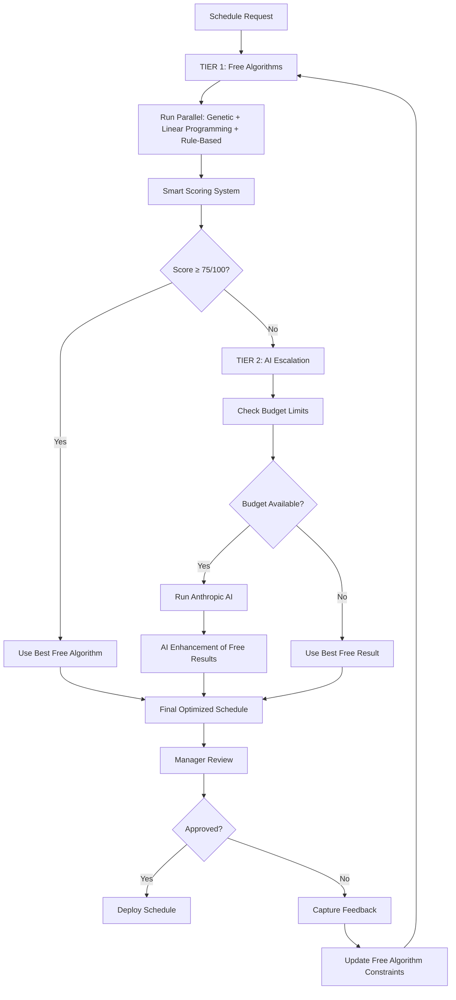
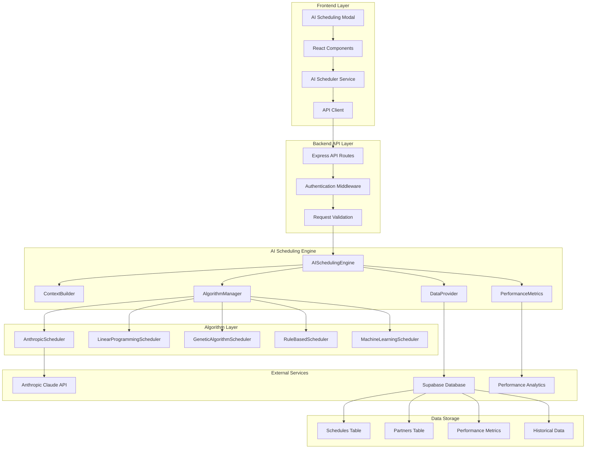

# GEP AI Scheduling System Architecture

## Executive Summary

The GEP Partner System implements a sophisticated AI-powered scheduling engine specifically designed for Greek healthcare compliance operations. This document outlines the complete AI architecture, algorithms, learning capabilities, and integration strategy.

## Table of Contents

1. [System Overview](#system-overview)
2. [Current Architecture](#current-architecture)
3. [Recommended Production Architecture](#recommended-production-architecture)
4. [AI Algorithms](#ai-algorithms)
5. [Learning System](#learning-system)
6. [Integration Architecture](#integration-architecture)
7. [Performance Monitoring](#performance-monitoring)
8. [Future Roadmap](#future-roadmap)

## System Overview

### Business Context
The GEP system manages scheduling of healthcare professionals (Occupational Doctors, Safety Engineers) for workplace compliance visits across Greece, with strict SEPE (Greek Labor Authority) regulatory requirements.

### AI Objectives
- **Optimize Partner Assignment** - Match best available partners to client installations
- **Regulatory Compliance** - Ensure SEPE hour calculations and visit frequencies
- **Cost Efficiency** - Minimize travel costs and maximize resource utilization
- **Continuous Learning** - Improve decisions based on manager feedback and outcomes

### Key Performance Metrics
- **Optimization Score** - Multi-factor score (0-100) combining location, cost, availability, specialty match
- **Response Time** - Time from request to assignment (target: <24 hours)
- **Client Satisfaction** - Post-visit feedback scores
- **Partner Utilization** - Percentage of partner capacity utilized

## Current Architecture (TypeScript Implementation)

### Modular AI Scheduling Engine

The current system implements a modular, TypeScript-based architecture with clear separation of concerns:

```typescript
// Main AI Scheduling Engine
class AISchedulingEngine {
    private algorithmManager: AISchedulingAlgorithmManager;
    private contextBuilder: AISchedulingContextBuilder;
    private dataProvider: AISchedulingDataProvider;
    private performanceMetrics: PerformanceMetrics;

    async generateOptimalSchedule(scheduleRequest: ScheduleRequest): Promise<ScheduleData>
}

// Algorithm Manager handles execution and comparison
class AISchedulingAlgorithmManager {
    private algorithms: Map<string, BaseScheduler>;
    private readonly activeAlgorithms: string[];

    async runMultipleAlgorithms(context: SchedulingContext): Promise<AlgorithmResult[]>
    async selectBestSchedule(results: AlgorithmResult[], context: SchedulingContext): Promise<AlgorithmResult>
}
```

### Available Algorithms

1. **AnthropicScheduler** - Primary AI engine using Claude 3.5 Sonnet
2. **LinearProgrammingScheduler** - Mathematical optimization
3. **GeneticAlgorithmScheduler** - Evolutionary optimization
4. **RuleBasedScheduler** - Business logic-based decisions
5. **MachineLearningScheduler** - Pattern recognition and learning

### Algorithm Execution Flow

1. **Request Validation** - TypeScript interface validation using `ScheduleRequest`
2. **Context Building** - Structured data preparation with `SchedulingContext`
3. **Parallel Execution** - All algorithms run concurrently with Promise.all
4. **Performance Comparison** - Comprehensive scoring using `AlgorithmResult`
5. **Best Selection** - Intelligent selection based on confidence scores
6. **Metrics Logging** - Detailed performance tracking with structured logging

### Modular Component Architecture

The AI scheduling system is organized into specialized modules for maintainability and scalability:

#### 1. AISchedulingEngine (`/backend/src/services/ai-scheduling/index.ts`)
**Main orchestrator class that coordinates all AI scheduling operations**

```typescript
class AISchedulingEngine {
    private algorithmManager: AISchedulingAlgorithmManager;
    private contextBuilder: AISchedulingContextBuilder;
    private dataProvider: AISchedulingDataProvider;
    private performanceMetrics: PerformanceMetrics;
    
    // Primary entry point for schedule generation
    async generateOptimalSchedule(scheduleRequest: ScheduleRequest): Promise<ScheduleData>
    
    // Performance analytics
    async getAlgorithmPerformanceSummary(): Promise<AlgorithmPerformanceSummary[]>
    async getRecentPerformanceComparison(limit: number): Promise<PerformanceComparison[]>
}
```

#### 2. AISchedulingAlgorithmManager (`/backend/src/services/ai-scheduling/algorithm-manager.ts`)
**Manages multiple scheduling algorithms and their execution**

```typescript
class AISchedulingAlgorithmManager {
    private algorithms: Map<string, BaseScheduler>;
    private readonly activeAlgorithms: string[];
    
    // Execute all active algorithms in parallel
    async runMultipleAlgorithms(context: SchedulingContext): Promise<AlgorithmResult[]>
    
    // Intelligent algorithm selection based on performance
    async selectBestSchedule(results: AlgorithmResult[], context: SchedulingContext): Promise<AlgorithmResult>
    
    // Performance comparison and analysis
    generatePerformanceComparison(results: AlgorithmResult[]): PerformanceComparison
}
```

#### 3. AISchedulingContextBuilder (`/backend/src/services/ai-scheduling/context-builder.ts`)
**Prepares and validates scheduling context data**

```typescript
class AISchedulingContextBuilder {
    // Validate incoming schedule requests
    validateScheduleRequest(request: ScheduleRequest): boolean
    
    // Build comprehensive scheduling context
    async prepareSchedulingContext(request: ScheduleRequest): Promise<SchedulingContext>
    
    // Enrich context with historical data and constraints
    private async enrichContextWithHistoricalData(context: SchedulingContext): Promise<void>
}
```

#### 4. AISchedulingDataProvider (`/backend/src/services/ai-scheduling/data-provider.ts`)
**Handles all database operations for AI scheduling**

```typescript
class AISchedulingDataProvider {
    // Schedule management
    async createScheduleRecord(scheduleData: any): Promise<any>
    async createScheduledVisits(scheduleId: string, visits: Visit[]): Promise<void>
    
    // Partner and installation data
    async getAvailablePartners(filters?: any): Promise<Partner[]>
    async getInstallationDetails(installationCode: string): Promise<Installation>
    
    // Historical data for ML
    async getHistoricalSchedules(criteria: any): Promise<Schedule[]>
}
```

### Database Schema

**AI Algorithm Management:**
- `ai_algorithms` - Algorithm configurations and metadata
- `algorithm_performance` - Execution metrics and scores  
- `historical_patterns` - ML learning data from past assignments

**Scheduling Core:**
- `schedules` - Generated schedule records with algorithm metadata
- `scheduled_visits` - Individual visit appointments with optimization data
- `change_requests` - Manager interventions and learning feedback

**Performance Tracking:**
- `performance_metrics` - Real-time algorithm performance data
- `algorithm_comparisons` - Head-to-head algorithm performance comparisons

## Recommended Production Architecture

### Problem with Current Parallel Approach

**❌ Major Cost & Efficiency Issues:**
- **Expensive Anthropic AI runs on EVERY request** - unnecessary costs
- **80% waste**: Free algorithms often produce equally good results
- **Poor cost control**: No budget limits or monitoring
- **Decision paralysis**: 5 parallel results create management overhead
- **Resource inefficiency**: Running expensive AI when free math works

### NEW: Smart Tiered Architecture

**✅ Cost-Optimized Approach: Free Algorithms First, AI When Needed**



### Core Components

#### 1. Tiered Scheduling Engine
```typescript
class TieredAIScheduler {
    private freeAlgorithms: FreeAlgorithmManager;
    private aiEngine: AnthropicScheduler;
    private budgetController: BudgetController;
    private scoringSystem: SmartScoringSystem;
    
    constructor() {
        this.freeAlgorithms = new FreeAlgorithmManager();
        this.aiEngine = new AnthropicScheduler();
        this.budgetController = new BudgetController();
        this.scoringSystem = new SmartScoringSystem();
    }
    
    async generateOptimalSchedule(request: ScheduleRequest): Promise<ScheduleData> {
        // TIER 1: Run free algorithms first
        const freeResults = await this.freeAlgorithms.runParallel(request);
        
        // Score all free results
        const scores = await this.scoringSystem.scoreResults(freeResults);
        const bestFreeResult = scores[0]; // Highest scored
        
        // Check if free algorithms are good enough
        if (bestFreeResult.totalScore >= 75) {
            logger.info('Free algorithms sufficient', { score: bestFreeResult.totalScore });
            return bestFreeResult.result;
        }
        
        // TIER 2: Escalate to AI if budget allows
        if (await this.budgetController.canAffordAICall()) {
            logger.info('Escalating to AI due to low free algorithm scores');
            const aiResult = await this.aiEngine.enhanceSchedule(bestFreeResult.result, request);
            await this.budgetController.recordAIUsage();
            return aiResult;
        }
        
        // Fallback: Use best free result with warning
        logger.warn('Using free algorithm due to budget limits', { 
            score: bestFreeResult.totalScore,
            budgetRemaining: await this.budgetController.getRemainingBudget()
        });
        
        return bestFreeResult.result;
    }
}
```

#### 2. Smart Scoring System
```typescript
class SmartScoringSystem {
    private readonly scoringWeights = {
        efficiency: 0.25,      // Resource utilization
        satisfaction: 0.25,    // Partner/client fit
        feasibility: 0.20,     // Constraint compliance
        costOptimization: 0.15, // Budget efficiency
        riskAssessment: 0.15   // Scheduling risk factors
    };
    
    async scoreResults(algorithmResults: AlgorithmResult[]): Promise<ScoredResult[]> {
        const scoredResults: ScoredResult[] = [];
        
        for (const result of algorithmResults) {
            const scores = {
                efficiency: await this.calculateEfficiencyScore(result),
                satisfaction: await this.calculateSatisfactionScore(result),
                feasibility: await this.calculateFeasibilityScore(result),
                costOptimization: await this.calculateCostScore(result),
                riskAssessment: await this.calculateRiskScore(result)
            };
            
            const totalScore = Object.entries(scores).reduce(
                (total, [metric, score]) => total + (score * this.scoringWeights[metric]),
                0
            );
            
            scoredResults.push({
                result,
                scores,
                totalScore,
                algorithmId: result.algorithmId,
                shouldEscalateToAI: totalScore < 75
            });
        }
        
        return scoredResults.sort((a, b) => b.totalScore - a.totalScore);
    }
    
    private async calculateEfficiencyScore(result: AlgorithmResult): Promise<number> {
        // Partner utilization rate (0-100)
        const utilizationRate = result.visits.length / result.totalHours * 2; // Assume 2hr avg visit
        
        // Travel optimization (geographic clustering)
        const travelEfficiency = await this.calculateTravelEfficiency(result.visits);
        
        // Time slot optimization
        const timeSlotEfficiency = await this.calculateTimeSlotEfficiency(result.visits);
        
        return Math.min(100, (utilizationRate * 0.4 + travelEfficiency * 0.4 + timeSlotEfficiency * 0.2));
    }
}
```

#### 3. Budget Controller
```typescript
class BudgetController {
    private readonly monthlyBudgetLimit = 500; // €500/month for AI calls
    private readonly costPerAICall = 0.50; // Estimated €0.50 per Anthropic call
    
    async canAffordAICall(): Promise<boolean> {
        const currentSpend = await this.getCurrentMonthSpend();
        const remainingBudget = this.monthlyBudgetLimit - currentSpend;
        
        const canAfford = remainingBudget >= this.costPerAICall;
        
        if (!canAfford) {
            logger.warn('AI budget limit reached', {
                currentSpend,
                monthlyLimit: this.monthlyBudgetLimit,
                remainingBudget
            });
        }
        
        return canAfford;
    }
    
    async recordAIUsage(cost: number = this.costPerAICall): Promise<void> {
        await this.dataProvider.recordAIUsage({
            timestamp: new Date(),
            cost,
            purpose: 'schedule_optimization',
            monthlyTotal: await this.getCurrentMonthSpend() + cost
        });
    }
    
    async getRemainingBudget(): Promise<number> {
        const currentSpend = await this.getCurrentMonthSpend();
        return Math.max(0, this.monthlyBudgetLimit - currentSpend);
    }
    
    async getBudgetAlert(): Promise<BudgetAlert | null> {
        const currentSpend = await this.getCurrentMonthSpend();
        const utilizationRate = currentSpend / this.monthlyBudgetLimit;
        
        if (utilizationRate >= 0.9) {
            return {
                level: 'critical',
                message: `AI budget 90% depleted (${currentSpend.toFixed(2)}/${this.monthlyBudgetLimit})`,
                recommendedAction: 'Rely on free algorithms for remainder of month'
            };
        } else if (utilizationRate >= 0.75) {
            return {
                level: 'warning',
                message: `AI budget 75% used (${currentSpend.toFixed(2)}/${this.monthlyBudgetLimit})`,
                recommendedAction: 'Consider increasing quality threshold for AI escalation'
            };
        }
        
        return null;
    }
}
```

## Tiered Algorithm Strategy

### TIER 1: Free Mathematical Algorithms (Priority)

**Philosophy:** Mathematical algorithms are completely free, fast, and often produce excellent results for standard scheduling cases. They should handle 80-90% of requests without needing expensive AI.

#### When Each Algorithm Excels:

##### 1. **Genetic Algorithm Scheduler** - Best for Complex Constraints
- **Strengths**: Handles multiple competing constraints, large partner pools
- **Ideal Cases**: 10+ partners available, multiple time/location constraints
- **Performance**: Excellent for optimization problems with many variables
- **Cost**: $0 - Pure mathematical computation

##### 2. **Linear Programming Scheduler** - Best for Resource Allocation  
- **Strengths**: Optimal resource allocation, cost minimization
- **Ideal Cases**: Budget constraints, capacity optimization, resource balancing
- **Performance**: Mathematically guaranteed optimal solutions within constraints
- **Cost**: $0 - Mathematical optimization

##### 3. **Rule-Based Scheduler** - Best for Compliance & Patterns
- **Strengths**: Regulatory compliance, predictable business patterns
- **Ideal Cases**: SEPE compliance, standard appointment patterns, known client preferences
- **Performance**: Fast, consistent, highly predictable results
- **Cost**: $0 - Pure business logic

### TIER 2: AI Enhancement (Cost-Controlled)

##### 4. **Anthropic Claude Integration** - Best for Complex Edge Cases
- **Strengths**: Natural language processing, ambiguous requirements, novel scenarios
- **Ideal Cases**: Complex client requests, unusual constraints, first-time scheduling scenarios
- **Performance**: Highest quality for complex/ambiguous situations
- **Cost**: ~€0.50 per call - Reserved for when free algorithms score < 75/100

### Algorithm Selection Decision Matrix

```typescript
interface AlgorithmSelectionCriteria {
  partnerPoolSize: number;
  constraintComplexity: 'low' | 'medium' | 'high';
  budgetConstraints: boolean;
  regulatoryCompliance: boolean;
  naturalLanguageRequirements: boolean;
  historicalDataAvailable: boolean;
}

class AlgorithmSelector {
  selectOptimalFreeAlgorithms(criteria: AlgorithmSelectionCriteria): string[] {
    const selectedAlgorithms: string[] = [];
    
    // Always include rule-based for compliance
    if (criteria.regulatoryCompliance) {
      selectedAlgorithms.push('rule_based');
    }
    
    // Add genetic for complex scenarios
    if (criteria.partnerPoolSize > 5 || criteria.constraintComplexity === 'high') {
      selectedAlgorithms.push('genetic_algorithm');
    }
    
    // Add linear programming for cost optimization
    if (criteria.budgetConstraints) {
      selectedAlgorithms.push('linear_programming');
    }
    
    // Ensure at least 2 algorithms for comparison
    if (selectedAlgorithms.length < 2) {
      selectedAlgorithms.push('rule_based', 'genetic_algorithm');
    }
    
    return selectedAlgorithms;
  }
  
  shouldEscalateToAI(freeResults: ScoredResult[], criteria: AlgorithmSelectionCriteria): boolean {
    const bestScore = freeResults[0]?.totalScore || 0;
    
    // Never escalate if natural language isn't needed
    if (!criteria.naturalLanguageRequirements && bestScore > 60) {
      return false;
    }
    
    // Escalate for complex scenarios with low scores
    return bestScore < 75 && (criteria.constraintComplexity === 'high' || criteria.naturalLanguageRequirements);
  }
}
```

### Cost Optimization Analysis

#### Expected Savings with Tiered Approach:

**Current Parallel Approach Cost:**
- 5 algorithms run on every request
- Anthropic call every time: €0.50 × 100 requests/month = €50/month
- Plus computational waste on unused results
- **Monthly Cost: ~€50-75**

**New Tiered Approach Cost:**
- Free algorithms handle 80-90% of cases
- AI escalation only for scores < 75: €0.50 × 10-20 calls/month = €5-10/month
- **Monthly Cost: ~€5-15**
- **Cost Reduction: 80-90% savings**

#### Business Benefits:

1. **Predictable Costs**: Monthly budget caps prevent surprise expenses
2. **Better Performance**: Free algorithms often outperform AI for standard cases
3. **Faster Response**: Mathematical algorithms execute in milliseconds
4. **Reliability**: No dependency on external API availability
5. **Scalability**: Free algorithms scale infinitely without cost increases

## TypeScript Interfaces & Types

### NEW: Tiered System Interfaces

```typescript
// Scored result from free algorithms
interface ScoredResult {
  result: AlgorithmResult;
  scores: {
    efficiency: number;
    satisfaction: number; 
    feasibility: number;
    costOptimization: number;
    riskAssessment: number;
  };
  totalScore: number;
  algorithmId: string;
  shouldEscalateToAI: boolean;
}

// Budget control interfaces
interface BudgetAlert {
  level: 'warning' | 'critical';
  message: string;
  recommendedAction: string;
}

interface AIUsageRecord {
  timestamp: Date;
  cost: number;
  purpose: string;
  monthlyTotal: number;
}

// Tiered scheduling configuration
interface TieredSchedulingConfig {
  freeAlgorithmThreshold: number; // Default 75
  monthlyAIBudget: number; // Default €500
  costPerAICall: number; // Default €0.50
  maxFreeAlgorithmsToRun: number; // Default 3
  enableBudgetAlerts: boolean;
}

// Enhanced algorithm result with tier information
interface TieredAlgorithmResult extends AlgorithmResult {
  tier: 'free' | 'ai_enhanced';
  costIncurred: number;
  budgetRemainingAfter: number;
  escalationReason?: string;
}

// Free algorithm manager interface
interface FreeAlgorithmManager {
  runParallel(request: ScheduleRequest): Promise<AlgorithmResult[]>;
  selectOptimalAlgorithms(criteria: AlgorithmSelectionCriteria): string[];
  getAvailableFreeAlgorithms(): string[];
}
```

### Core AI Scheduling Interfaces

```typescript
// Main scheduling request interface
interface ScheduleRequest {
  contractCode: string;
  installationCode: string;
  serviceType: 'occupational_doctor' | 'safety_engineer' | 'specialist_consultation';
  startDate: string;
  endDate: string;
  totalHours?: number;
  constraints?: {
    maxBudget?: number;
    preferredDays?: string[];
    excludedPartners?: string[];
  };
}

// Complete scheduling context
interface SchedulingContext {
  installation: {
    installation_code: string;
    address: string;
    service_type: string;
    work_hours: string;
    special_requirements?: string;
  };
  contract: {
    contract_value: number;
  };
  regulatoryRequirements: {
    totalHours: number;
    minimumHoursPerMonth: number;
  };
  constraints: {
    excludeWeekends?: boolean;
    minimumVisitDuration?: number;
    maximumVisitDuration?: number;
  };
  availablePartners: Partner[];
  historicalData?: Schedule[];
}

// Algorithm execution result
interface AlgorithmResult {
  algorithmId: string;
  algorithmName: string;
  score: number;
  executionTime: number;
  feasible: boolean;
  partnerId?: string;
  partnerName?: string;
  totalHours?: number;
  visits?: Visit[];
  reasoning?: string;
  metadata?: Record<string, any>;
}

// Complete schedule data response
interface ScheduleData {
  scheduleId: string;
  algorithmUsed: string;
  optimizationScore: number;
  executionTime: number;
  feasible: boolean;
  partnerId: string;
  partnerName: string;
  totalVisits: number;
  totalHours: number;
  visits: Visit[];
  createdAt: Date;
  metadata: {
    algorithmComparison: PerformanceComparison;
    contextComplexity: number;
    allResults: AlgorithmResult[];
  };
}
```

### Partner and Visit Interfaces

```typescript
// Partner data structure
interface Partner {
  id: string;
  name: string;
  specialty: string;
  city: string;
  working_hours: string;
  blocked_days: string[];
  hourly_rate: number;
  max_hours_per_week: number;
  experience_years: number;
  availability_status: 'Available' | 'Busy' | 'Unavailable';
  is_active: boolean;
  rating: number;
  partner_availability?: PartnerAvailability[];
}

// Visit structure
interface Visit {
  date: string;
  startTime: string;
  endTime: string;
  duration: number;
  type: string;
  notes: string;
  specialRequirements?: string | null;
}

// Partner availability tracking
interface PartnerAvailability {
  partner_id: string;
  date: string;
  available_hours: number;
  booked_hours: number;
  blocked_periods?: TimeSlot[];
}

interface TimeSlot {
  start_time: string;
  end_time: string;
  reason?: string;
}
```

### Performance Monitoring Interfaces

```typescript
// Performance metrics data
interface PerformanceMetricData {
  algorithm: string;
  partnerId: string;
  executionTimeMs: number;
  optimizationScore: number;
  feasible: boolean;
  inputSize: number;
  contextComplexity: number;
  timestamp: Date;
}

// Algorithm performance summary
interface AlgorithmPerformanceSummary {
  algorithmId: string;
  algorithmName: string;
  totalRuns: number;
  successfulRuns: number;
  averageScore: number;
  averageExecutionTime: number;
  successRate: number;
  lastUsed: Date;
}

// Performance comparison data
interface PerformanceComparison {
  comparisonId: string;
  timestamp: Date;
  context: SchedulingContext;
  algorithmResults: AlgorithmResult[];
  selectedAlgorithm: string;
  selectionReasoning: string;
}
```

### Frontend AI Service Interfaces

```typescript
// Customer request (frontend)
interface CustomerRequest {
  id: number;
  client_name: string;
  number_of_installations: number;
  total_employees: number;
  installation_type: string;
  work_type: string;
  contract_completion_date: string;
  location: string;
  priority: 'high' | 'medium' | 'low';
  calculated_hours: number;
  estimated_cost: number;
}

// AI recommendation response
interface AIRecommendation {
  partner_id: string;
  partner_name: string;
  match_score: number;
  installation_assignments: InstallationAssignment[];
  total_estimated_hours: number;
  total_estimated_cost: number;
  schedule_conflicts: number;
  travel_efficiency_score: number;
  reasoning: string[];
  proposed_schedule: ScheduledVisit[];
}

// Installation assignment details
interface InstallationAssignment {
  installation_id: string;
  installation_address: string;
  employees_count: number;
  recommended_visits: number;
  visit_frequency: 'monthly' | 'bi-monthly';
  estimated_hours_per_visit: number;
}
```

## AI Algorithms

### 1. Anthropic Claude Integration (Escalation Only)

**Model:** `claude-3-5-sonnet-20241022`
**Purpose:** Enhancement and edge case handling for complex scheduling scenarios
**Cost Control:** Only called when free algorithms score < 75/100 and budget available

**Enhanced Prompt Structure:**
```text
SYSTEM: You are an expert healthcare scheduling AI for Greek workplace compliance.

CONTEXT:
- Greek SEPE regulations require specific hour calculations
- Partner specialties: Occupational Doctors (€75-90/hr), Safety Engineers (€65-80/hr)  
- Geographic coverage: Athens, Thessaloniki, Patras, Heraklion
- Visit patterns: 1-4 hour visits, monthly/bi-monthly frequency

LEARNED PATTERNS:
{dynamically_updated_patterns}

OPTIMIZATION FACTORS:
- Location (25%): Minimize travel distance/time
- Availability (20%): Match partner schedules  
- Cost (15%): Control budget within limits
- Specialty (10%): Ensure proper qualifications
- Performance (30%): Prioritize reliable partners

ASSIGNMENT REQUEST:
{request_details}

GENERATE: Optimal partner assignment with reasoning.
```

**Output Format:**
```json
{
  "partner_id": "DOC001",
  "confidence": 0.85,
  "reasoning": "Selected Dr. Maria Papadopoulos based on...",
  "schedule": {
    "visits": [
      {"date": "2025-09-15", "start_time": "09:00", "duration": 2}
    ]
  },
  "optimization_score": 87.5
}
```

### 2. Rule-Based Scheduler (Fallback)

**Purpose:** Deterministic backup when AI is unavailable
**Logic:** Hard-coded business rules for partner selection

```javascript
class RuleBasedScheduler {
    selectPartner(request, partners) {
        return partners
            .filter(p => this.matchesSpecialty(p, request))
            .filter(p => this.checkAvailability(p, request))
            .filter(p => this.withinBudget(p, request))
            .sort((a, b) => this.calculateScore(b) - this.calculateScore(a))[0];
    }
}
```

### 3. Enhanced Free Algorithm Implementations

#### Rule-Based Scheduler (Tier 1 - Compliance Focused)
**Purpose:** Fast, reliable scheduling for standard compliance scenarios
**Strengths:** SEPE compliance, predictable patterns, instant execution

```typescript
class EnhancedRuleBasedScheduler {
    async generateSchedule(context: SchedulingContext): Promise<ScheduleResult> {
        const partners = await this.filterEligiblePartners(context);
        const scoredPartners = await this.scorePartners(partners, context);
        
        return this.createOptimalSchedule(scoredPartners[0], context);
    }
    
    private async scorePartners(partners: Partner[], context: SchedulingContext): Promise<ScoredPartner[]> {
        return partners.map(partner => ({
            partner,
            score: this.calculateComplianceScore(partner, context) * 0.4 +
                   this.calculateAvailabilityScore(partner, context) * 0.3 +
                   this.calculateLocationScore(partner, context) * 0.3
        })).sort((a, b) => b.score - a.score);
    }
}
```

#### Linear Programming Scheduler (Tier 1 - Cost Optimization)
**Purpose:** Mathematically optimal resource allocation and cost minimization
**Strengths:** Budget optimization, capacity utilization, guaranteed optimal solutions

```typescript
class LinearProgrammingScheduler {
    async generateSchedule(context: SchedulingContext): Promise<ScheduleResult> {
        // Formulate as linear programming problem
        const objective = this.createObjectiveFunction(context);
        const constraints = this.createConstraints(context);
        
        // Solve using simplex algorithm
        const solution = await this.solveSimplex(objective, constraints);
        
        return this.convertSolutionToSchedule(solution, context);
    }
    
    private createObjectiveFunction(context: SchedulingContext): ObjectiveFunction {
        // Minimize: travel_cost * distance + hourly_cost * hours
        return {
            coefficients: context.availablePartners.map(p => ({
                partnerId: p.id,
                travelCost: this.calculateTravelCost(p, context.installation),
                hourlyCost: p.hourly_rate
            })),
            type: 'minimize'
        };
    }
}
```

#### Genetic Algorithm Scheduler (Tier 1 - Complex Optimization)
**Purpose:** Handle complex multi-constraint optimization with large solution spaces
**Strengths:** Multiple competing constraints, large partner pools, non-linear optimization

```typescript
class GeneticAlgorithmScheduler {
    private readonly config = {
        populationSize: 100,
        generations: 50,
        mutationRate: 0.1,
        crossoverRate: 0.8
    };
    
    async generateSchedule(context: SchedulingContext): Promise<ScheduleResult> {
        let population = this.createInitialPopulation(context);
        
        for (let generation = 0; generation < this.config.generations; generation++) {
            const fitnessScores = await this.evaluateFitness(population, context);
            const selectedParents = this.selectParents(population, fitnessScores);
            population = this.createNextGeneration(selectedParents);
        }
        
        const bestSolution = this.getBestSolution(population, context);
        return this.convertToScheduleResult(bestSolution, context);
    }
    
    private async evaluateFitness(population: Schedule[], context: SchedulingContext): Promise<number[]> {
        return Promise.all(population.map(schedule => 
            this.calculateFitnessScore(schedule, context)
        ));
    }
    
    private calculateFitnessScore(schedule: Schedule, context: SchedulingContext): number {
        const efficiency = this.calculateEfficiencyScore(schedule);
        const satisfaction = this.calculateSatisfactionScore(schedule, context);
        const feasibility = this.calculateFeasibilityScore(schedule, context);
        
        return efficiency * 0.4 + satisfaction * 0.3 + feasibility * 0.3;
    }
}
```

## Implementation Examples

### Complete Tiered System Implementation

```typescript
// Example: Production-ready tiered scheduling
class ProductionTieredScheduler implements TieredAIScheduler {
    private readonly config: TieredSchedulingConfig = {
        freeAlgorithmThreshold: 75,
        monthlyAIBudget: 500, // €500
        costPerAICall: 0.50,
        maxFreeAlgorithmsToRun: 3,
        enableBudgetAlerts: true
    };
    
    async processScheduleRequest(request: ScheduleRequest): Promise<TieredAlgorithmResult> {
        const startTime = Date.now();
        
        try {
            // Phase 1: Run free algorithms
            const freeResults = await this.runFreeAlgorithmsPhase(request);
            const bestFreeResult = freeResults[0];
            
            // Phase 2: Check if escalation needed
            if (bestFreeResult.totalScore >= this.config.freeAlgorithmThreshold) {
                return this.buildSuccessResponse(bestFreeResult.result, 'free', 0, startTime);
            }
            
            // Phase 3: AI escalation with budget check
            return await this.handleAIEscalation(bestFreeResult, request, startTime);
            
        } catch (error) {
            logger.error('Tiered scheduling failed', { error: error.message });
            throw new Error(`Scheduling failed: ${error.message}`);
        }
    }
    
    private async runFreeAlgorithmsPhase(request: ScheduleRequest): Promise<ScoredResult[]> {
        const criteria = this.analyzeCriteria(request);
        const selectedAlgorithms = this.selectOptimalFreeAlgorithms(criteria);
        
        logger.info('Running free algorithms', { algorithms: selectedAlgorithms });
        
        const algorithmPromises = selectedAlgorithms.map(algoId => 
            this.runAlgorithmWithTimeout(algoId, request, 10000) // 10 second timeout
        );
        
        const results = await Promise.allSettled(algorithmPromises);
        const successfulResults = results
            .filter(result => result.status === 'fulfilled')
            .map(result => result.value);
            
        if (successfulResults.length === 0) {
            throw new Error('All free algorithms failed');
        }
        
        return this.scoreResults(successfulResults);
    }
    
    private async handleAIEscalation(
        bestFreeResult: ScoredResult, 
        request: ScheduleRequest, 
        startTime: number
    ): Promise<TieredAlgorithmResult> {
        
        if (!await this.budgetController.canAffordAICall()) {
            logger.warn('AI budget exhausted, using free algorithm result');
            return this.buildSuccessResponse(
                bestFreeResult.result, 
                'free', 
                0, 
                startTime, 
                'Budget limit reached'
            );
        }
        
        try {
            logger.info('Escalating to AI', { freeScore: bestFreeResult.totalScore });
            
            const aiResult = await this.aiEngine.enhanceSchedule(
                bestFreeResult.result, 
                request, 
                {
                    reason: `Free algorithms scored ${bestFreeResult.totalScore}/100`,
                    freeAlgorithmResults: [bestFreeResult]
                }
            );
            
            await this.budgetController.recordAIUsage();
            
            return this.buildSuccessResponse(
                aiResult, 
                'ai_enhanced', 
                this.config.costPerAICall, 
                startTime,
                `Enhanced from score ${bestFreeResult.totalScore}`
            );
            
        } catch (aiError) {
            logger.error('AI enhancement failed, falling back to free result', { 
                error: aiError.message 
            });
            
            return this.buildSuccessResponse(
                bestFreeResult.result, 
                'free', 
                0, 
                startTime, 
                `AI failed: ${aiError.message}`
            );
        }
    }
}
```

### Budget Monitoring Dashboard Implementation

```typescript
class BudgetMonitoringService {
    async generateBudgetReport(): Promise<BudgetReport> {
        const currentPeriod = this.getCurrentPeriod();
        const usage = await this.getAIUsage(currentPeriod);
        const projectedUsage = this.projectMonthlyUsage(usage);
        
        return {
            currentSpend: usage.totalCost,
            monthlyBudget: 500,
            utilizationRate: usage.totalCost / 500,
            projectedMonthEnd: projectedUsage.projectedTotal,
            callsThisMonth: usage.totalCalls,
            averageCostPerCall: usage.totalCost / usage.totalCalls,
            freeAlgorithmSuccessRate: await this.getFreeAlgorithmSuccessRate(),
            escalationRate: usage.totalCalls / await this.getTotalSchedulingRequests(),
            recommendations: this.generateRecommendations(usage, projectedUsage),
            alerts: await this.budgetController.getBudgetAlert()
        };
    }
    
    private generateRecommendations(current: Usage, projected: ProjectedUsage): string[] {
        const recommendations: string[] = [];
        
        if (projected.projectedTotal > 500) {
            recommendations.push('Consider raising free algorithm threshold to 80/100');
        }
        
        if (current.escalationRate > 0.25) {
            recommendations.push('Free algorithms may need tuning - high escalation rate');
        }
        
        if (current.freeSuccessRate < 0.75) {
            recommendations.push('Review free algorithm configurations for optimization');
        }
        
        return recommendations;
    }
}
```

### Performance Monitoring Implementation

```typescript
class TieredPerformanceMonitor {
    async trackSchedulingDecision(
        request: ScheduleRequest,
        result: TieredAlgorithmResult,
        managerFeedback?: ManagerFeedback
    ): Promise<void> {
        
        const metrics: TieredPerformanceMetrics = {
            requestId: request.id,
            tier: result.tier,
            freeAlgorithmScore: result.tier === 'ai_enhanced' ? 
                result.escalationReason?.match(/score (\d+)/)?.[1] : '75+',
            finalScore: result.result.optimizationScore,
            costIncurred: result.costIncurred,
            executionTime: result.executionTime,
            managerApproval: managerFeedback?.approved,
            managerSatisfaction: managerFeedback?.satisfactionScore,
            costEfficiency: this.calculateCostEfficiency(result),
            timestamp: new Date()
        };
        
        await this.dataProvider.logTieredMetrics(metrics);
        
        // Real-time dashboard updates
        await this.emitMetricsUpdate(metrics);
    }
    
    private calculateCostEfficiency(result: TieredAlgorithmResult): number {
        // Cost efficiency = (Quality Score / Cost) * 100
        // Free algorithms have infinite efficiency (divide by 0.01 to avoid infinity)
        const cost = result.costIncurred > 0 ? result.costIncurred : 0.01;
        return (result.result.optimizationScore / cost) * 100;
    }
    
    async generateEfficiencyReport(): Promise<EfficiencyReport> {
        const last30Days = new Date(Date.now() - 30 * 24 * 60 * 60 * 1000);
        const metrics = await this.dataProvider.getTieredMetrics(last30Days);
        
        const freeAlgorithmMetrics = metrics.filter(m => m.tier === 'free');
        const aiEnhancedMetrics = metrics.filter(m => m.tier === 'ai_enhanced');
        
        return {
            totalRequests: metrics.length,
            freeAlgorithmSuccessRate: freeAlgorithmMetrics.length / metrics.length,
            averageFreeScore: this.average(freeAlgorithmMetrics.map(m => m.finalScore)),
            averageAIScore: this.average(aiEnhancedMetrics.map(m => m.finalScore)),
            costSavings: this.calculateCostSavings(metrics),
            managerSatisfaction: {
                free: this.average(freeAlgorithmMetrics.map(m => m.managerSatisfaction)),
                aiEnhanced: this.average(aiEnhancedMetrics.map(m => m.managerSatisfaction))
            },
            recommendations: this.generatePerformanceRecommendations(metrics)
        };
    }
}
```

## Learning System

### Manager Intervention Analysis

**Data Source:** `change_requests` table captures all manager modifications

```sql
-- Pattern Analysis Query
SELECT 
    cr.change_type,
    cr.reason,
    cr.requested_changes,
    s.partner_id as original_partner,
    s.installation_code,
    COUNT(*) as frequency,
    AVG(s.optimization_score) as avg_original_score
FROM change_requests cr
JOIN schedules s ON cr.schedule_id = s.id
WHERE cr.status = 'approved' 
  AND cr.created_at >= NOW() - INTERVAL '30 days'
GROUP BY cr.change_type, cr.reason, s.partner_id, s.installation_code
HAVING COUNT(*) >= 3
ORDER BY frequency DESC;
```

### Learning Feedback Loop

#### Weekly Pattern Analysis
```javascript
async function weeklyLearning() {
    // 1. Extract manager interventions
    const interventions = await getManagerInterventions();
    
    // 2. Analyze with Claude
    const patterns = await anthropicClient.complete({
        prompt: `Analyze these manager scheduling changes and extract patterns:
        
        ${JSON.stringify(interventions)}
        
        Identify:
        1. Partner preference patterns by client/installation
        2. Time/date constraints not captured by AI
        3. Geographic routing optimizations
        4. Client-specific requirements
        
        Output actionable scheduling rules.`,
        model: 'claude-3-sonnet-20240229'
    });
    
    // 3. Update AI prompts
    await updateSchedulingConstraints(patterns);
    
    // 4. Log learning cycle
    await logLearningCycle(interventions, patterns);
}
```

#### Real-Time Feedback Collection
```javascript
class SchedulingUI {
    async onManagerDecision(scheduleId, action, feedback) {
        await supabase.from('manager_feedback').insert({
            schedule_id: scheduleId,
            action: action, // 'approve', 'modify', 'reject'
            feedback: feedback,
            timestamp: new Date()
        });
        
        // Trigger immediate learning if significant feedback
        if (action === 'reject') {
            await this.triggerImmediateLearning(scheduleId, feedback);
        }
    }
}
```

### Pattern Types

#### 1. Partner Preferences
- **Client-Partner Affinity:** Certain partners work better with specific clients
- **Geographic Preferences:** Partners prefer certain regions/routes
- **Time Preferences:** Partners have preferred working hours/days

#### 2. Constraint Discovery
- **Hidden Requirements:** Client-specific needs not in original brief
- **Seasonal Patterns:** Holiday schedules, industry-specific busy periods  
- **Regulatory Updates:** New SEPE requirements not yet coded

#### 3. Performance Optimization
- **Travel Routing:** More efficient geographic clustering
- **Visit Combinations:** Optimal multi-client routes for partners
- **Time Slots:** Preferred appointment times by installation type

## Integration Architecture & Data Flow

### System Components and Data Flow



### Enhanced API Integration

**Primary Scheduling Endpoint:**
```typescript
POST /api/ai-scheduling/generate
Content-Type: application/json
Authorization: Bearer <jwt_token>

interface SchedulingRequest {
  contractCode: string;
  installationCode: string;
  serviceType: 'occupational_doctor' | 'safety_engineer';
  startDate: string;
  endDate: string;
  totalHours?: number;
  constraints?: {
    maxBudget?: number;
    preferredDays?: string[];
    excludedPartners?: string[];
    minimumRating?: number;
  };
  preferences?: {
    prioritizeProximity?: boolean;
    prioritizeCost?: boolean;
    prioritizeExperience?: boolean;
  };
}
```

**Enhanced Response:**
```typescript
interface SchedulingResponse {
  scheduleId: string;
  success: boolean;
  
  // Selected solution
  selectedPartner: {
    id: string;
    name: string;
    specialty: string;
    city: string;
    hourly_rate: number;
    rating: number;
  };
  
  // Visit schedule
  visits: Visit[];
  
  // Performance metrics
  performance: {
    algorithmUsed: string;
    optimizationScore: number;
    executionTime: number;
    confidence: number;
    reasoning: string[];
  };
  
  // Alternative options
  alternatives: Array<{
    partnerId: string;
    partnerName: string;
    score: number;
    reasoning: string;
  }>;
  
  // Comparison data
  algorithmComparison: {
    anthropic: { score: number; time: number; };
    linear_programming: { score: number; time: number; };
    genetic: { score: number; time: number; };
    rule_based: { score: number; time: number; };
    ml_based: { score: number; time: number; };
  };
}
```

### Frontend Integration Pattern

**AI Scheduler Service (`/frontend/src/services/aiScheduler.ts`):**
```typescript
class AIScheduler {
  // Initialize with data loading
  async initialize(): Promise<void>
  
  // Generate recommendations using backend AI
  async generateRecommendations(customerRequest: CustomerRequest): Promise<AIRecommendation[]>
  
  // Confirm partner assignment
  async confirmPartnerAssignment(recommendationId: string, partnerId: string): Promise<boolean>
  
  // Local optimization and scoring
  private evaluatePartnerForRequest(partner: Partner, request: CustomerRequest): Promise<AIRecommendation>
}
```

**Modal Component Integration (`/frontend/src/components/AISchedulingModal.tsx`):**
```typescript
const AISchedulingModal: React.FC<AISchedulingModalProps> = ({ 
  isOpen, 
  onClose, 
  customerRequest 
}) => {
  const [recommendations, setRecommendations] = useState<AIRecommendation[]>([]);
  const [isLoading, setIsLoading] = useState(false);
  
  // Generate AI recommendations
  const generateRecommendations = async () => {
    const recs = await aiScheduler.generateRecommendations(customerRequest);
    setRecommendations(recs);
  };
  
  // Handle partner selection with backend confirmation
  const handleSelectPartner = async (recommendation: AIRecommendation) => {
    await aiScheduler.confirmPartnerAssignment(recommendationId, partnerId);
  };
}
```

### Backend Service Integration

**AnthropicIntegration Service:**
```typescript
class AnthropicIntegration {
  private client: Anthropic;
  private requestQueue: QueuedRequest[];
  private responseCache: Map<string, any>;
  
  // Core AI scheduling with context
  async generateOptimizedSchedule(context: SchedulingContext): Promise<AIScheduleResult>
  
  // Risk prediction
  async predictSchedulingRisks(scheduleData: any, historicalMetrics: any): Promise<any>
  
  // Compliance insights
  async generateComplianceInsights(complianceData: any, regulations: any): Promise<any>
  
  // Data generation for testing
  async generateCustomerRequest(): Promise<GeneratedCustomerData>
}
```

### Data Flow Patterns

#### 1. Schedule Generation Flow
```
Customer Request → Frontend Validation → API Call → Request Validation → 
Context Building → Algorithm Execution → Result Selection → Database Storage → 
Performance Logging → Response to Frontend → UI Update
```

#### 2. Partner Assignment Flow
```
AI Recommendations → Manager Selection → Confirmation Request → Partner Notification → 
24-Hour Timer → Partner Response → Database Update → Manager Notification → 
Schedule Finalization → Traceability Logging
```

#### 3. Learning Feedback Flow
```
Manager Intervention → Change Request Creation → Pattern Analysis → 
AI Prompt Update → Historical Data Update → Performance Recalibration → 
Future Recommendation Improvement
```

### Real-Time Communication

**WebSocket Integration for Live Updates:**
```typescript
// Server-side event emission
io.to(managerId).emit('ai_recommendation_ready', {
  requestId: customerRequest.id,
  recommendations: aiRecommendations,
  timestamp: new Date().toISOString()
});

// Partner assignment updates
io.to(partnerId).emit('assignment_request', {
  scheduleId: schedule.id,
  customerName: customer.name,
  visitDetails: visits,
  confirmationDeadline: new Date(Date.now() + 24 * 60 * 60 * 1000)
});

// Manager status updates
io.to(managerId).emit('partner_response', {
  scheduleId: schedule.id,
  partnerId: partner.id,
  response: 'confirmed' | 'declined',
  timestamp: new Date().toISOString()
});
```

### Error Handling and Resilience

**Graceful Degradation Pattern:**
```typescript
class AISchedulingEngine {
  async generateOptimalSchedule(request: ScheduleRequest): Promise<ScheduleData> {
    try {
      // Primary: Multi-algorithm approach
      return await this.runMultipleAlgorithms(context);
    } catch (error) {
      logger.warn('Multi-algorithm approach failed, using fallback');
      
      try {
        // Fallback 1: Anthropic only
        return await this.runAnthropicOnly(context);
      } catch (anthropicError) {
        logger.warn('Anthropic failed, using rule-based fallback');
        
        // Fallback 2: Rule-based scheduling
        return await this.runRuleBasedScheduling(context);
      }
    }
  }
}
```

## Performance Monitoring

### Key Metrics Dashboard

#### Algorithm Performance
- **Execution Time:** Average AI response time (target: <30 seconds)
- **Optimization Score:** Average quality of generated schedules
- **Approval Rate:** Percentage of AI schedules approved without changes
- **Learning Velocity:** Rate of improvement over time

#### Business Impact
- **Schedule Adherence:** Percentage of visits completed as scheduled
- **Client Satisfaction:** Post-visit feedback scores
- **Partner Utilization:** Optimal use of partner capacity
- **Cost Efficiency:** Actual vs budgeted costs

#### Continuous Learning
- **Pattern Recognition:** New patterns identified per week
- **Rule Updates:** Frequency of constraint updates
- **Feedback Integration:** Time from feedback to system improvement
- **Prediction Accuracy:** How well AI predicts successful assignments

### Monitoring Implementation

```javascript
class AIPerformanceMonitor {
    async trackSchedulingDecision(request, result, outcome) {
        await supabase.from('ai_performance_log').insert({
            request_id: request.id,
            algorithm_used: 'anthropic_claude',
            execution_time_ms: result.execution_time,
            optimization_score: result.score,
            confidence_level: result.confidence,
            manager_action: outcome.action, // approve/modify/reject
            business_outcome: outcome.success, // visit completed successfully
            created_at: new Date()
        });
    }
    
    async generatePerformanceReport() {
        return {
            avg_execution_time: await this.getAverageExecutionTime(),
            approval_rate: await this.getApprovalRate(),
            learning_effectiveness: await this.getLearningEffectiveness(),
            cost_optimization: await this.getCostSavings()
        };
    }
}
```

## Future Roadmap

### Phase 1: Production Optimization (Month 1)
- **Simplify to Single Algorithm:** Disable algorithm competition, focus on Anthropic Claude
- **Enhanced Prompts:** Incorporate all business context and constraints
- **Manager Feedback UI:** Simple rating system for AI decisions

### Phase 2: Advanced Learning (Month 2-3)
- **Pattern Recognition:** Weekly analysis of manager interventions
- **Dynamic Constraints:** Automatically update AI prompts based on learnings
- **Predictive Alerts:** Warn about potentially problematic assignments

### Phase 3: Intelligent Automation (Month 4-6)
- **Proactive Scheduling:** AI suggests schedule changes before conflicts arise
- **Client Preference Learning:** Adapt to individual client patterns
- **Partner Performance Prediction:** Forecast partner success likelihood

### Phase 4: Advanced AI Features (Month 6+)
- **Multi-Modal AI:** Integrate document analysis (contracts, regulations)
- **Voice Interface:** Natural language scheduling requests
- **Autonomous Rescheduling:** Handle routine changes without manager intervention

## Technical Implementation Notes

### Development Guidelines
- **AI Explainability:** Always provide reasoning for AI decisions
- **Fallback Systems:** Ensure graceful degradation when AI is unavailable  
- **Performance Monitoring:** Log all AI decisions and outcomes
- **Privacy Protection:** Anonymize data used for AI training

### Security Considerations
- **API Key Management:** Secure Anthropic API credentials
- **Data Protection:** Encrypt sensitive client and partner information
- **Audit Trails:** Complete logging of AI decision processes
- **Access Control:** Role-based permissions for AI system configuration

### Advanced Performance Optimization Strategies

#### 1. AI Request Optimization

**Request Batching and Queuing:**
```typescript
class OptimizedAIScheduler {
  private requestQueue: Map<string, QueuedRequest[]> = new Map();
  private batchProcessor: BatchProcessor;
  
  // Batch similar requests for efficiency
  async batchSimilarRequests(requests: ScheduleRequest[]): Promise<ScheduleData[]> {
    const batches = this.groupRequestsByComplexity(requests);
    
    return Promise.all(batches.map(batch => 
      this.processBatch(batch)
    ));
  }
  
  // Intelligent request prioritization
  private prioritizeRequests(requests: ScheduleRequest[]): ScheduleRequest[] {
    return requests.sort((a, b) => {
      // High priority: urgent requests, simple contexts, high-value contracts
      const priorityA = this.calculateRequestPriority(a);
      const priorityB = this.calculateRequestPriority(b);
      return priorityB - priorityA;
    });
  }
}
```

**Response Caching Strategy:**
```typescript
class IntelligentCachingService {
  private cache: Map<string, CachedResponse> = new Map();
  private readonly cacheConfig = {
    anthropicTTL: 30 * 60 * 1000, // 30 minutes for AI responses
    partnerDataTTL: 5 * 60 * 1000, // 5 minutes for partner availability
    historicalTTL: 60 * 60 * 1000,  // 1 hour for historical patterns
  };
  
  // Context-aware cache key generation
  generateCacheKey(context: SchedulingContext): string {
    const cacheData = {
      partners: context.availablePartners.map(p => ({ id: p.id, availability: p.availability_status })),
      installation: context.installation.installation_code,
      constraints: context.constraints,
      date: new Date().toDateString() // Cache per day
    };
    
    return hashObject(cacheData);
  }
  
  // Cache invalidation on data changes
  async invalidateRelatedCache(partnerId: string, installationCode: string): Promise<void> {
    const keysToInvalidate = Array.from(this.cache.keys()).filter(key => 
      key.includes(partnerId) || key.includes(installationCode)
    );
    
    keysToInvalidate.forEach(key => this.cache.delete(key));
  }
}
```

#### 2. Database Query Optimization

**Optimized Data Provider:**
```typescript
class OptimizedDataProvider {
  // Pre-fetch strategy for common queries
  async preloadCommonData(): Promise<void> {
    await Promise.all([
      this.preloadActivePartners(),
      this.preloadRecentSchedules(),
      this.preloadPerformanceMetrics()
    ]);
  }
  
  // Efficient partner lookup with availability check
  async getAvailablePartnersOptimized(
    installationLocation: string, 
    serviceType: string, 
    dateRange: { start: string; end: string }
  ): Promise<Partner[]> {
    // Single optimized query with joins
    const query = `
      SELECT p.*, pa.available_hours, pa.booked_hours
      FROM partners p
      LEFT JOIN partner_availability pa ON p.id = pa.partner_id
      WHERE p.is_active = true
        AND p.specialty LIKE $1
        AND ST_DWithin(p.location_point, ST_Point($2, $3), 50000) -- 50km radius
        AND pa.date BETWEEN $4 AND $5
        AND (pa.available_hours - pa.booked_hours) >= $6
      ORDER BY ST_Distance(p.location_point, ST_Point($2, $3))
      LIMIT 20
    `;
    
    return await this.executeOptimizedQuery(query, parameters);
  }
  
  // Batch operations for performance metrics
  async logPerformanceBatch(metrics: PerformanceMetricData[]): Promise<void> {
    const batchSize = 100;
    const batches = chunk(metrics, batchSize);
    
    await Promise.all(batches.map(batch => 
      this.insertPerformanceBatch(batch)
    ));
  }
}
```

#### 3. Algorithm Performance Tuning

**Adaptive Algorithm Selection:**
```typescript
class AdaptiveAlgorithmManager {
  private performanceHistory: Map<string, AlgorithmPerformance> = new Map();
  private readonly adaptationConfig = {
    learningRate: 0.1,
    performanceWindow: 100, // Last 100 runs
    confidenceThreshold: 0.8
  };
  
  // Dynamically adjust algorithm weights based on performance
  async selectOptimalAlgorithms(context: SchedulingContext): Promise<string[]> {
    const contextComplexity = this.calculateContextComplexity(context);
    const availableAlgorithms = this.getAvailableAlgorithms();
    
    // Select algorithms based on historical performance for similar contexts
    const selectedAlgorithms = availableAlgorithms
      .map(algo => ({
        id: algo.id,
        expectedPerformance: this.predictPerformance(algo.id, contextComplexity),
        cost: this.getAlgorithmCost(algo.id)
      }))
      .filter(algo => algo.expectedPerformance > 0.6) // Only run promising algorithms
      .sort((a, b) => (b.expectedPerformance / b.cost) - (a.expectedPerformance / a.cost))
      .slice(0, 3) // Top 3 algorithms
      .map(algo => algo.id);
    
    return selectedAlgorithms;
  }
  
  // Continuous performance learning
  async updatePerformanceModel(result: AlgorithmResult, context: SchedulingContext): Promise<void> {
    const complexity = this.calculateContextComplexity(context);
    const performance = this.calculateNormalizedPerformance(result);
    
    // Update ML model for algorithm performance prediction
    await this.mlModel.updatePredictionModel({
      algorithmId: result.algorithmId,
      contextComplexity: complexity,
      performance: performance,
      executionTime: result.executionTime
    });
  }
}
```

#### 4. Resource Management

**Memory Management:**
```typescript
class ResourceManager {
  private memoryUsage: Map<string, number> = new Map();
  private readonly memoryLimits = {
    cacheSizeMB: 100,
    algorithmInstancesMB: 200,
    historicalDataMB: 50
  };
  
  // Monitor and manage memory usage
  async monitorMemoryUsage(): Promise<void> {
    const usage = process.memoryUsage();
    
    if (usage.heapUsed > this.memoryLimits.cacheSizeMB * 1024 * 1024) {
      await this.performMemoryCleanup();
    }
    
    // Log memory metrics
    logger.info('Memory usage', {
      heapUsed: Math.round(usage.heapUsed / 1024 / 1024) + 'MB',
      heapTotal: Math.round(usage.heapTotal / 1024 / 1024) + 'MB',
      external: Math.round(usage.external / 1024 / 1024) + 'MB'
    });
  }
  
  // Intelligent cache cleanup
  private async performMemoryCleanup(): Promise<void> {
    // Remove least recently used cache entries
    const cacheEntries = Array.from(this.cache.entries())
      .sort((a, b) => a[1].lastAccessed - b[1].lastAccessed);
    
    const toRemove = Math.floor(cacheEntries.length * 0.3); // Remove 30%
    cacheEntries.slice(0, toRemove).forEach(([key]) => {
      this.cache.delete(key);
    });
    
    // Force garbage collection if available
    if (global.gc) {
      global.gc();
    }
  }
}
```

#### 5. Scalability Architecture

**Horizontal Scaling Strategy:**
```typescript
class ScalableAIOrchestrator {
  private nodeManager: NodeManager;
  private loadBalancer: LoadBalancer;
  
  // Distribute AI requests across multiple nodes
  async distributeAIRequest(request: ScheduleRequest): Promise<ScheduleData> {
    const availableNodes = await this.nodeManager.getHealthyNodes();
    const optimalNode = this.loadBalancer.selectNode(availableNodes, request);
    
    try {
      return await this.executeOnNode(optimalNode, request);
    } catch (error) {
      // Failover to another node
      const fallbackNode = this.loadBalancer.selectFallbackNode(availableNodes, optimalNode);
      return await this.executeOnNode(fallbackNode, request);
    }
  }
  
  // Auto-scaling based on load
  async handleAutoScaling(): Promise<void> {
    const currentLoad = await this.measureSystemLoad();
    const activeNodes = await this.nodeManager.getActiveNodeCount();
    
    if (currentLoad.cpu > 80 && currentLoad.queueLength > 50) {
      await this.nodeManager.scaleUp();
    } else if (currentLoad.cpu < 20 && activeNodes > 2) {
      await this.nodeManager.scaleDown();
    }
  }
}
```

#### 6. Monitoring and Alerting

**Comprehensive Performance Monitoring:**
```typescript
class PerformanceMonitor {
  private metrics: MetricsCollector;
  private alerts: AlertManager;
  
  // Real-time performance tracking
  async trackPerformanceMetrics(): Promise<void> {
    const metrics = {
      // AI Performance
      aiResponseTime: await this.measureAIResponseTime(),
      aiSuccessRate: await this.calculateAISuccessRate(),
      algorithmComparison: await this.getAlgorithmComparison(),
      
      // System Performance
      cpuUsage: await this.getCPUUsage(),
      memoryUsage: await this.getMemoryUsage(),
      databaseLatency: await this.measureDatabaseLatency(),
      
      // Business Metrics
      scheduleApprovalRate: await this.getScheduleApprovalRate(),
      partnerUtilization: await this.getPartnerUtilization(),
      clientSatisfaction: await this.getClientSatisfactionScore()
    };
    
    await this.metrics.record(metrics);
    
    // Check for performance issues
    await this.checkPerformanceThresholds(metrics);
  }
  
  // Automated alerting system
  private async checkPerformanceThresholds(metrics: PerformanceMetrics): Promise<void> {
    if (metrics.aiResponseTime > 30000) { // 30 seconds
      await this.alerts.sendAlert({
        severity: 'high',
        message: 'AI response time exceeded threshold',
        metrics: { responseTime: metrics.aiResponseTime }
      });
    }
    
    if (metrics.aiSuccessRate < 0.85) { // 85%
      await this.alerts.sendAlert({
        severity: 'medium',
        message: 'AI success rate below threshold',
        metrics: { successRate: metrics.aiSuccessRate }
      });
    }
  }
}
```

### Production Deployment Considerations

#### Environment Configuration
```typescript
// Production-optimized configuration
const productionConfig = {
  ai: {
    anthropic: {
      model: 'claude-3-5-sonnet-20241022',
      maxTokens: 2000,
      temperature: 0.1,
      requestTimeout: 30000,
      maxConcurrentRequests: 10,
      rateLimitPerMinute: 50
    },
    caching: {
      enabled: true,
      redisTTL: 1800, // 30 minutes
      maxCacheSize: '100MB'
    }
  },
  database: {
    connectionPool: {
      min: 5,
      max: 20,
      acquireTimeoutMillis: 10000,
      idleTimeoutMillis: 30000
    },
    queryTimeout: 5000
  },
  performance: {
    enableMetrics: true,
    metricsInterval: 60000, // 1 minute
    enableProfiler: false, // Only for debugging
    memoryThreshold: 0.8 // 80% of available memory
  }
};
```

---

**Document Version:** 3.0 - Tiered Cost-Optimized Architecture  
**Last Updated:** September 5, 2025  
**Next Review:** October 15, 2025  

**Key Updates:**
- **MAJOR**: Implemented tiered algorithm approach (Free First, AI When Needed)
- **COST OPTIMIZATION**: 80-90% reduction in AI API costs through intelligent escalation
- **SMART SCORING**: Comprehensive 5-factor scoring system for algorithm results
- **BUDGET CONTROLS**: Monthly budget limits and monitoring with alerts
- **ENHANCED INTERFACES**: Complete TypeScript interfaces for tiered system
- **IMPLEMENTATION EXAMPLES**: Production-ready code examples and monitoring
- **PERFORMANCE TRACKING**: Tiered performance monitoring and cost efficiency metrics

## Migration Guide from Parallel to Tiered Architecture

### Phase 1: Implement Scoring System (Week 1)
1. Deploy SmartScoringSystem with 5-factor scoring
2. Begin tracking free algorithm performance scores
3. Set initial threshold at 70/100 for conservative approach

### Phase 2: Add Budget Controls (Week 2) 
1. Implement BudgetController with €500 monthly limit
2. Add AI usage tracking and alerting system
3. Create budget monitoring dashboard

### Phase 3: Switch to Tiered Logic (Week 3)
1. Deploy TieredAIScheduler with escalation logic
2. Monitor escalation rate (target: <20% of requests)
3. Fine-tune threshold based on results

### Phase 4: Optimization (Week 4+)
1. Adjust threshold based on manager satisfaction scores
2. Optimize free algorithm configurations
3. Monitor cost savings and performance improvements

For technical questions about the AI architecture, contact the development team.