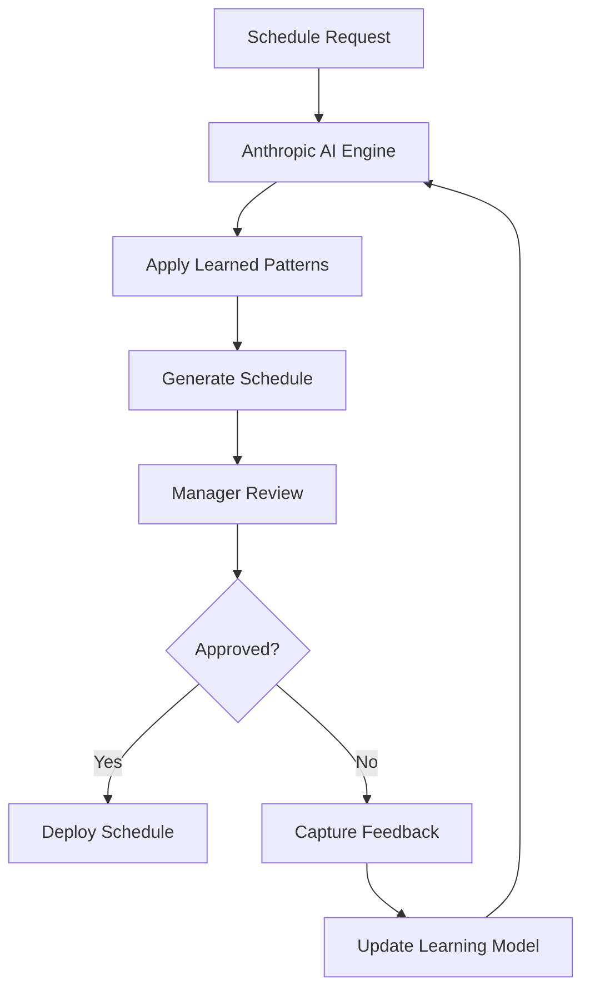
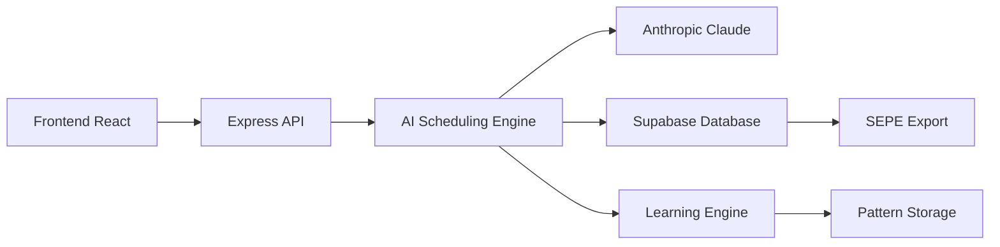

# GEP AI Scheduling System Architecture

## Executive Summary

The GEP Partner System implements a sophisticated AI-powered scheduling engine specifically designed for Greek healthcare compliance operations. This document outlines the complete AI architecture, algorithms, learning capabilities, and integration strategy.

## Table of Contents

1. [System Overview](#system-overview)
2. [Current Architecture](#current-architecture)
3. [Recommended Production Architecture](#recommended-production-architecture)
4. [AI Algorithms](#ai-algorithms)
5. [Learning System](#learning-system)
6. [Integration Architecture](#integration-architecture)
7. [Performance Monitoring](#performance-monitoring)
8. [Future Roadmap](#future-roadmap)

## System Overview

### Business Context
The GEP system manages scheduling of healthcare professionals (Occupational Doctors, Safety Engineers) for workplace compliance visits across Greece, with strict SEPE (Greek Labor Authority) regulatory requirements.

### AI Objectives
- **Optimize Partner Assignment** - Match best available partners to client installations
- **Regulatory Compliance** - Ensure SEPE hour calculations and visit frequencies
- **Cost Efficiency** - Minimize travel costs and maximize resource utilization
- **Continuous Learning** - Improve decisions based on manager feedback and outcomes

### Key Performance Metrics
- **Optimization Score** - Multi-factor score (0-100) combining location, cost, availability, specialty match
- **Response Time** - Time from request to assignment (target: <24 hours)
- **Client Satisfaction** - Post-visit feedback scores
- **Partner Utilization** - Percentage of partner capacity utilized

## Current Architecture

### Multi-Algorithm Orchestration Engine

The current system implements 5 parallel algorithms with performance comparison:

```javascript
class AISchedulingEngine {
    algorithms: {
        'linear_programming': LinearProgrammingScheduler,
        'genetic': GeneticAlgorithmScheduler, 
        'ml_based': MachineLearningScheduler,
        'rule_based': RuleBasedScheduler,
        'anthropic': AnthropicScheduler
    }
}
```

### Algorithm Execution Flow

1. **Request Validation** - Validate scheduling parameters
2. **Context Preparation** - Gather partners, constraints, historical data
3. **Parallel Execution** - Run all active algorithms simultaneously
4. **Result Comparison** - Score and rank algorithm outputs
5. **Best Selection** - Choose optimal schedule using composite scoring
6. **Performance Logging** - Track algorithm performance metrics

### Database Schema

**AI Algorithm Management:**
- `ai_algorithms` - Algorithm configurations and metadata
- `algorithm_performance` - Execution metrics and scores
- `historical_patterns` - ML learning data from past assignments

**Scheduling Core:**
- `schedules` - Generated schedule records
- `scheduled_visits` - Individual visit appointments
- `change_requests` - Manager interventions and modifications

## Recommended Production Architecture

### Problem with Current Approach

**❌ Over-Engineering Issues:**
- 5 algorithms create decision paralysis for managers
- 80% computational waste on unused results
- Inconsistent user experience
- Complex maintenance and debugging

### Simplified Production Architecture

**✅ Optimal Approach: Single Intelligent Algorithm + Learning**



### Core Components

#### 1. Primary AI Engine (Anthropic Claude)
```javascript
class ProductionAIScheduler {
    constructor() {
        this.anthropicClient = new Anthropic();
        this.learningEngine = new ContinuousLearner();
        this.ruleEngine = new RuleBasedScheduler(); // Fallback
    }
    
    async generateSchedule(request) {
        // Enhanced prompt with learned patterns
        const prompt = await this.buildEnhancedPrompt(request);
        
        // Generate schedule with AI
        const schedule = await this.anthropicClient.complete({
            model: 'claude-3-sonnet-20240229',
            prompt: prompt,
            max_tokens: 4000
        });
        
        // Apply learned constraints
        return await this.learningEngine.applyLearnings(schedule);
    }
}
```

#### 2. Continuous Learning System
```javascript
class ContinuousLearner {
    async analyzeManagerInterventions() {
        // Query manager changes from last 30 days
        const interventions = await this.getManagerChanges();
        
        // Identify patterns using Claude
        const patterns = await this.anthropicClient.analyze({
            data: interventions,
            task: 'Extract scheduling preference patterns'
        });
        
        // Update scheduling rules
        await this.updateConstraints(patterns);
    }
}
```

## AI Algorithms

### 1. Anthropic Claude Integration (Primary)

**Model:** `claude-3-sonnet-20240229`
**Purpose:** Primary scheduling intelligence with natural language reasoning

**Enhanced Prompt Structure:**
```text
SYSTEM: You are an expert healthcare scheduling AI for Greek workplace compliance.

CONTEXT:
- Greek SEPE regulations require specific hour calculations
- Partner specialties: Occupational Doctors (€75-90/hr), Safety Engineers (€65-80/hr)  
- Geographic coverage: Athens, Thessaloniki, Patras, Heraklion
- Visit patterns: 1-4 hour visits, monthly/bi-monthly frequency

LEARNED PATTERNS:
{dynamically_updated_patterns}

OPTIMIZATION FACTORS:
- Location (25%): Minimize travel distance/time
- Availability (20%): Match partner schedules  
- Cost (15%): Control budget within limits
- Specialty (10%): Ensure proper qualifications
- Performance (30%): Prioritize reliable partners

ASSIGNMENT REQUEST:
{request_details}

GENERATE: Optimal partner assignment with reasoning.
```

**Output Format:**
```json
{
  "partner_id": "DOC001",
  "confidence": 0.85,
  "reasoning": "Selected Dr. Maria Papadopoulos based on...",
  "schedule": {
    "visits": [
      {"date": "2025-09-15", "start_time": "09:00", "duration": 2}
    ]
  },
  "optimization_score": 87.5
}
```

### 2. Rule-Based Scheduler (Fallback)

**Purpose:** Deterministic backup when AI is unavailable
**Logic:** Hard-coded business rules for partner selection

```javascript
class RuleBasedScheduler {
    selectPartner(request, partners) {
        return partners
            .filter(p => this.matchesSpecialty(p, request))
            .filter(p => this.checkAvailability(p, request))
            .filter(p => this.withinBudget(p, request))
            .sort((a, b) => this.calculateScore(b) - this.calculateScore(a))[0];
    }
}
```

### 3. Retired Algorithms

**Linear Programming, Genetic, ML-Based** - These add complexity without proportional value for this use case. Healthcare scheduling requires explainable, consistent decisions that managers can understand and trust.

## Learning System

### Manager Intervention Analysis

**Data Source:** `change_requests` table captures all manager modifications

```sql
-- Pattern Analysis Query
SELECT 
    cr.change_type,
    cr.reason,
    cr.requested_changes,
    s.partner_id as original_partner,
    s.installation_code,
    COUNT(*) as frequency,
    AVG(s.optimization_score) as avg_original_score
FROM change_requests cr
JOIN schedules s ON cr.schedule_id = s.id
WHERE cr.status = 'approved' 
  AND cr.created_at >= NOW() - INTERVAL '30 days'
GROUP BY cr.change_type, cr.reason, s.partner_id, s.installation_code
HAVING COUNT(*) >= 3
ORDER BY frequency DESC;
```

### Learning Feedback Loop

#### Weekly Pattern Analysis
```javascript
async function weeklyLearning() {
    // 1. Extract manager interventions
    const interventions = await getManagerInterventions();
    
    // 2. Analyze with Claude
    const patterns = await anthropicClient.complete({
        prompt: `Analyze these manager scheduling changes and extract patterns:
        
        ${JSON.stringify(interventions)}
        
        Identify:
        1. Partner preference patterns by client/installation
        2. Time/date constraints not captured by AI
        3. Geographic routing optimizations
        4. Client-specific requirements
        
        Output actionable scheduling rules.`,
        model: 'claude-3-sonnet-20240229'
    });
    
    // 3. Update AI prompts
    await updateSchedulingConstraints(patterns);
    
    // 4. Log learning cycle
    await logLearningCycle(interventions, patterns);
}
```

#### Real-Time Feedback Collection
```javascript
class SchedulingUI {
    async onManagerDecision(scheduleId, action, feedback) {
        await supabase.from('manager_feedback').insert({
            schedule_id: scheduleId,
            action: action, // 'approve', 'modify', 'reject'
            feedback: feedback,
            timestamp: new Date()
        });
        
        // Trigger immediate learning if significant feedback
        if (action === 'reject') {
            await this.triggerImmediateLearning(scheduleId, feedback);
        }
    }
}
```

### Pattern Types

#### 1. Partner Preferences
- **Client-Partner Affinity:** Certain partners work better with specific clients
- **Geographic Preferences:** Partners prefer certain regions/routes
- **Time Preferences:** Partners have preferred working hours/days

#### 2. Constraint Discovery
- **Hidden Requirements:** Client-specific needs not in original brief
- **Seasonal Patterns:** Holiday schedules, industry-specific busy periods  
- **Regulatory Updates:** New SEPE requirements not yet coded

#### 3. Performance Optimization
- **Travel Routing:** More efficient geographic clustering
- **Visit Combinations:** Optimal multi-client routes for partners
- **Time Slots:** Preferred appointment times by installation type

## Integration Architecture

### System Components



### API Integration

**Scheduling Endpoint:**
```javascript
POST /api/scheduling/generate
{
    "contract_code": "CNT001",
    "installation_code": "INST001", 
    "service_type": "occupational_doctor",
    "start_date": "2025-09-01",
    "end_date": "2025-12-31",
    "constraints": {
        "max_budget": 5000,
        "preferred_days": ["monday", "tuesday"],
        "excluded_partners": ["DOC002"]
    }
}
```

**Response:**
```javascript
{
    "schedule_id": "uuid",
    "partner": {
        "id": "DOC001",
        "name": "Dr. Maria Papadopoulos",
        "specialty": "occupational_doctor"
    },
    "visits": [...],
    "optimization_score": 87.5,
    "confidence": 0.85,
    "reasoning": "Selected based on proximity, availability, and high performance history",
    "alternatives": [...] // Top 3 alternative assignments
}
```

### Real-Time Updates

**WebSocket Integration:**
```javascript
// Real-time schedule updates
socket.emit('schedule_update', {
    schedule_id: scheduleId,
    status: 'partner_assigned',
    partner_id: partnerId,
    notification: 'Dr. Papadopoulos assigned to installation INST001'
});
```

## Performance Monitoring

### Key Metrics Dashboard

#### Algorithm Performance
- **Execution Time:** Average AI response time (target: <30 seconds)
- **Optimization Score:** Average quality of generated schedules
- **Approval Rate:** Percentage of AI schedules approved without changes
- **Learning Velocity:** Rate of improvement over time

#### Business Impact
- **Schedule Adherence:** Percentage of visits completed as scheduled
- **Client Satisfaction:** Post-visit feedback scores
- **Partner Utilization:** Optimal use of partner capacity
- **Cost Efficiency:** Actual vs budgeted costs

#### Continuous Learning
- **Pattern Recognition:** New patterns identified per week
- **Rule Updates:** Frequency of constraint updates
- **Feedback Integration:** Time from feedback to system improvement
- **Prediction Accuracy:** How well AI predicts successful assignments

### Monitoring Implementation

```javascript
class AIPerformanceMonitor {
    async trackSchedulingDecision(request, result, outcome) {
        await supabase.from('ai_performance_log').insert({
            request_id: request.id,
            algorithm_used: 'anthropic_claude',
            execution_time_ms: result.execution_time,
            optimization_score: result.score,
            confidence_level: result.confidence,
            manager_action: outcome.action, // approve/modify/reject
            business_outcome: outcome.success, // visit completed successfully
            created_at: new Date()
        });
    }
    
    async generatePerformanceReport() {
        return {
            avg_execution_time: await this.getAverageExecutionTime(),
            approval_rate: await this.getApprovalRate(),
            learning_effectiveness: await this.getLearningEffectiveness(),
            cost_optimization: await this.getCostSavings()
        };
    }
}
```

## Future Roadmap

### Phase 1: Production Optimization (Month 1)
- **Simplify to Single Algorithm:** Disable algorithm competition, focus on Anthropic Claude
- **Enhanced Prompts:** Incorporate all business context and constraints
- **Manager Feedback UI:** Simple rating system for AI decisions

### Phase 2: Advanced Learning (Month 2-3)
- **Pattern Recognition:** Weekly analysis of manager interventions
- **Dynamic Constraints:** Automatically update AI prompts based on learnings
- **Predictive Alerts:** Warn about potentially problematic assignments

### Phase 3: Intelligent Automation (Month 4-6)
- **Proactive Scheduling:** AI suggests schedule changes before conflicts arise
- **Client Preference Learning:** Adapt to individual client patterns
- **Partner Performance Prediction:** Forecast partner success likelihood

### Phase 4: Advanced AI Features (Month 6+)
- **Multi-Modal AI:** Integrate document analysis (contracts, regulations)
- **Voice Interface:** Natural language scheduling requests
- **Autonomous Rescheduling:** Handle routine changes without manager intervention

## Technical Implementation Notes

### Development Guidelines
- **AI Explainability:** Always provide reasoning for AI decisions
- **Fallback Systems:** Ensure graceful degradation when AI is unavailable  
- **Performance Monitoring:** Log all AI decisions and outcomes
- **Privacy Protection:** Anonymize data used for AI training

### Security Considerations
- **API Key Management:** Secure Anthropic API credentials
- **Data Protection:** Encrypt sensitive client and partner information
- **Audit Trails:** Complete logging of AI decision processes
- **Access Control:** Role-based permissions for AI system configuration

### Scalability Planning
- **Rate Limiting:** Manage Anthropic API usage and costs
- **Caching:** Cache frequently used AI responses
- **Load Balancing:** Distribute AI requests across multiple instances
- **Database Optimization:** Efficient querying of historical patterns

---

**Document Version:** 1.0  
**Last Updated:** September 3, 2025  
**Next Review:** October 1, 2025  

For technical questions about the AI architecture, contact the development team.